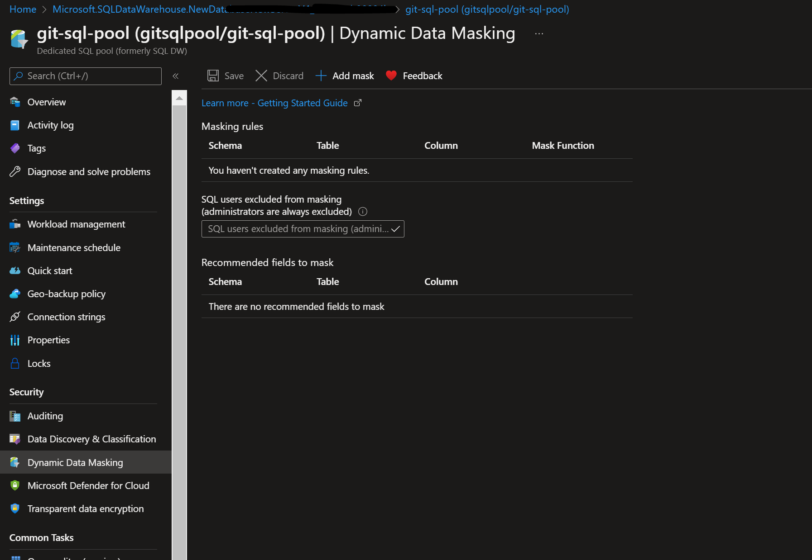

# Dynamic-Data-Masking-Azure
Dynamic Data Masking on the dedicated SQL pool of Azure Synapse Analytics. 
Azure SQL Database, Azure SQL Managed Instance, and Azure Synapse Analytics also supports dynamic data masking.

Its a real-time data masking, DDM changes the data stream so that the data requester does not get access to the sensitive data, while no physical changes to the original production data take place.

## Msking functions.
    * Default
    * Credit card	
    * Email
    * Random number
    * Custom text
You can mask SQL users as well AAD identities. Users with administrator privileges are excluded from masking.

## Quickstart
    * Azure dedicated SQL pool
    * SSMS or Azure data studio
    * Admin access (dbmanager access is sufficient) on sql pool

## inspect

    

## Steps
    1. Connect to DB using SSMS.
    2. Identify the columns in the table you want to mask.
        Command:
            ALTER TABLE [schema].[table] ALTER COLUMN [column_name] ADD MASKED WITH (FUNCTION = 'default()');
    3. By default all the users will be masked exceot user with Admin privilege.
    4. To unmask user from mask execute below.
        Command:
            GRANT UNMASK ON [schema].[table] TO [user]
